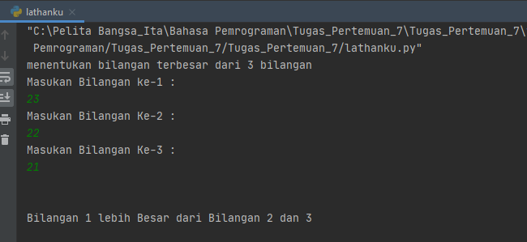
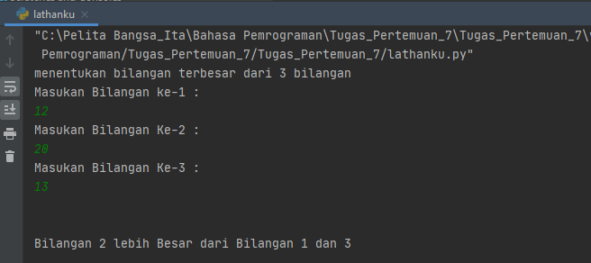
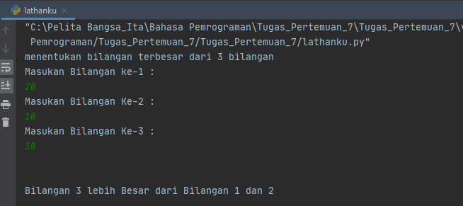
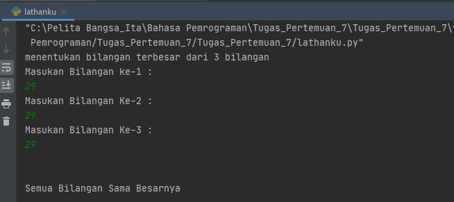

# Tugas_Pertemuan_7- Praktikum_labspy02

Repository ini dibuat untuk memenuhi tugas Bahasa Pemrograman Pertemuan ke-7 pada Modul Praktikum 2.

***Nama : Miftahu Rizkiyah***

***NIM : 312010014***

***Kelas : TI.20.B.1***

=====================

## Tugas Praktikum_labspy02
 
Membuat program sederhana dengan menginput 3 buah bilangan, dari ketiga bilangan tersebut tampilkan bilangan terbesarnya, dengan menggunakan *statement if*

## Menentukan Bilangan Terbesar dari 3 nilai yang diinputkan

Pada pertemuan ke-7 ini saya membuat tugas yang diberikan oleh dosen Bahasa Pemrograman - Teknik Informatika.
Untuk membuat aplikasi yang menentukan bilangan terbesar dari 3 bilangan yang user inputkan menggunakan bahasa program python.
<br>

.PNG) <br>


Pada repository ini saya akan menjelaskan alur didalam **Flowchart** yang telah saya buat. Untuk file **flowchart** bisa dilihat pada link berikut : 
[Tugas_Pertemuan_7](Flowchart_part7.pdf)
<br>

berikut source code yang saya buat atau klik link berikut ( [Labspy02](lathanku.py) ) : <br>

``` python
print("Masukan Bilangan ke-1 : ")
bilangan1=int(input())
print("Masukan Bilangan Ke-2 : ")
bilangan2=int(input())
print("Masukan Bilangan Ke-3 : ")
bilangan3=int(input())
```
berikut contoh (bilangan 1>bilangan2) and (bilangan 1>bilangan3) :<br>
Dengan source code : 

``` python
if ( bilangan1 > bilangan2 ) and ( bilangan1 > bilangan3 ) :
    print("Bilangan 1 lebih Besar dari Bilangan 2 dan 3")
```
Dari source code tersebut akan menghasilkan output :


<br>
* Ket : <br>
Kondisi ***if*** digunakan untuk mengeksekusi kode jika kondisi bernilai benar,True.
<br>

dan jika (bilangan 2>bilangan 1) and (bilangan 2>bilangan 3) :
dengan source code :

``` python
elif (bilangan2>bilangan1) and ( bilangan2 > bilangan3 ) :
    print ("Bilangan 2 lebih Besar dari Bilangan 1 dan 3")
```
Dari source code tersebut akan menghasilkan output : 

<br>
<br>

Selanjutnya jika (bilangan 3>bilangan1) and (bilangan 3>bilangan 2) dengan source code/syntax :

``` python
elif ( bilangan3 > bilangan1) and ( bilangan3 > bilangan2 ) :
    print ("Bilangan 3 lebih Besar dari Bilangan 1 dan 2")
```
Dari source code tersebut akan menghasilkan output :

<br>
* Ket : <br>
Pengambilan keputusan **(Kondisi if elif)** merupakan lanjutan/percabangan logika dari ***kondisi if***. Dengan elif kita bisa membuat kode program yang akan menyeleksi beberapa kemungkinan yang bisa terjadi.

Jika semua bilangan bernilai sama kita akan menggunakan kondisi ***else*** dengan source code berikut : <br>
``` python
else :
    print ("Semua Bilangan Sama Besarnya")
```

Dari syntax tersebut akan menghasilkan output : <br>
.
<br>
* Ket : <br>
***Kondisi if else*** adalah kondisi dimana jika pernyataan benar *True*, maka kode didalam if akan dieksekusi, tetapi jika bernilai salah *False* maka akan mengeksekusi kode didalam else.

### ***============ Thank You ============***
###      ***==Tugas Praktikum 2_Modul 2==***
###        ***==Repository_labspy02==***
#### ***Miftahu RIzkiyah - 312010014***
### ========================================